# Azure Hands-on Lab - Deploy your first Azure Virtual Machine

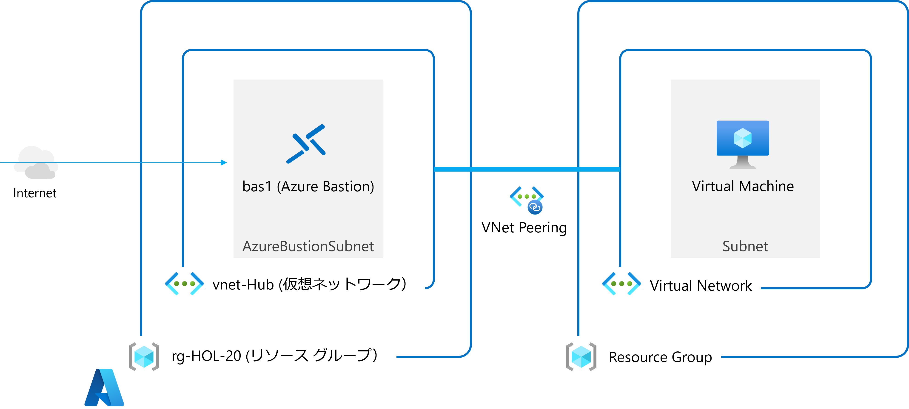

<br />

### Contents

- [リソース グループの作成](#リソース-グループの作成)

- [仮想ネットワークの展開](#仮想ネットワークの展開)

- [仮想マシンの展開](#仮想マシンの展開)

- [仮想ネットワーク-ピアリングの作成](#仮想ネットワーク-ピアリングの作成)

- [仮想マシンへの接続](#仮想マシンへの接続)

- [Appendix](#appendix)

  - [仮想マシンのサイズ変更](#仮想マシンのサイズ変更)

  - [変更履歴の確認](#変更履歴の確認)

<br />

## リソース グループの作成

- Azure Portal のトップ画面上部の「**リソースの作成**」をクリック

  

- 検索ボックスに 「**resource group**」と入力し、表示される候補より「**リソース グループ**」を選択

  

- 「**作成**」をクリック

  

- 「**基本**」タブで必要項目を入力

  - **サブスクリプション**： 使用中のサブスクリプションを選択

  - **リソース グループ**： 任意の名前を入力

  - **リージョン**： 使用する地域を選択

    


- 「**確認および作成**」をクリック

- 「**作成**」をクリック

  


<br />

## 仮想ネットワークの展開

- Azure Portal のトップ画面上部の「**リソースの作成**」をクリック

- 検索ボックスに 「**virtual network**」と入力し、表示される候補より「**Virtual Network**」を選択

  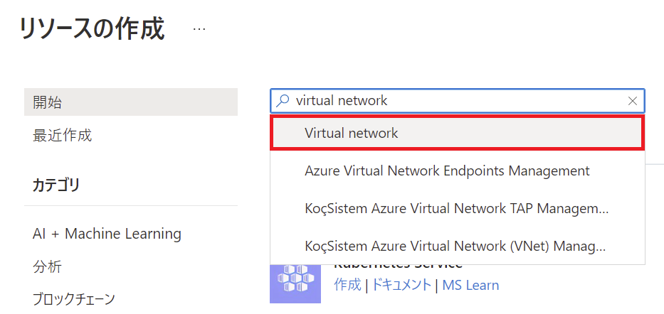

- 「**作成**」をクリック

  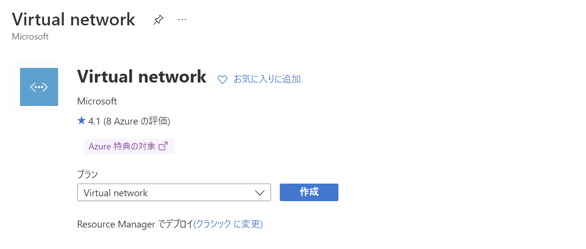

- 仮想ネットワークの作成

  - 「**基本**」タブで必要項目を入力し「**次: IP アドレス >**」をクリック

    - **サブスクリプション**： 使用中のサブスクリプションを選択

    - **リソース グループ**： 先の手順で作成したリソース グループを選択

    - **名前**： 任意の名前を入力（2 文字から 64 文字の長さで指定）

    - **地域**： 使用する地域を選択

      

  - 「**IP アドレス**」タブで必要項目を入力し「**次: セキュリティ >**」をクリック

    - IPv4 アドレス空間を指定

      

    - サブネットの追加

      

  - 「**セキュリティ**」タブは既定の設定のまま「**次: タグ >**」をクリック

    

  - 「**タグ**」タブは既定のまま「**確認および作成**」をクリック

    

- 設定した内容を確認し「**作成**」をクリック

  

<br />

## 仮想マシンの展開

- Azure Portal のトップ画面上部の「**リソースの作成**」をクリック

- 仮想マシンの **作成** をクリック

  

- 仮想マシンの作成

  - 「**基本**」タブ
  
    - プロジェクトの詳細

      - **サブスクリプション**： 使用するサブスクリプションを選択

      - **リソース グループ**： 先の手順で作成したリソース グループを選択

    - インスタンスの詳細

      - **仮想マシン名**： 任意

      - **地域**： 使用する地域を選択（作成した仮想ネットワークと同じ地域を選択）

      - **可用性オプション**： インフラストラクチャ冗長は必要ありません

      - **セキュリティの種類**： Standard

    - 管理者アカウント

      - **ユーザー名**： AzureUser（任意、1 ～ 20 文字）

      - **パスワード**： 任意（12 ～ 123 文字）

    - 受信ポートの規則

      - **パブリック受信ポート**： なし
  
    

  - 「**ディスク**」タブ

    - ディスクのオプション

      - **OS ディスクの種類**： Standard SSD (ローカル冗長ストレージ)

      - **VM と共に削除**： チェック

      - **暗号化の種類**： (既定) プラットフォーム マネージド キーを使用した保存時の暗号化

    

  - 「**ネットワーク**」タブ

    - ネットワーク インターフェイス

      - **仮想ネットワーク**： 先の手順で作成した仮想ネットワークを選択**

      - **サブネット**： 仮想マシンを展開するサブネットを選択

      - **パブリック IP**： なし

      - **NIC ネットワーク セキュリティ グループ**： Basic

      - **パブリック受信ポート**： なし

      - **VM が削除されたときに NIC を削除する**： チェック

      - **高速ネットワークを有効にする**： チェック
    
    - 負荷分散

      - **負荷分散のオプション**： なし
    
    
  
  - 「**管理**」タブは既定のまま「**次: 詳細 >**」をクリック

    

  - 「**詳細**」タブは既定のまま「**次: タグ**」をクリック

    

  - 「**タグ**」タブは既定のまま「**確認および作成**」をクリック

    

  - 設定した内容を確認し「**作成**」をクリック

    

- リソース グループを選択し、作成したリソースを確認

  

  ※ 仮想ネットワーク、仮想マシン、ネットワーク セキュリティ グループ、ネットワーク インターフェイス、ディスクの５つを確認

<br />

## 仮想ネットワーク ピアリングの作成

- リソース グループ内の仮想ネットワークを選択

- 仮想ネットワークの管理ブレードから「**ピアリング**」を選択

- 「**＋ 追加**」をクリック

  

- ピアリングの追加

  - この仮想ネットワーク

    - **ピアリング リンク名**： 任意の名前を入力

    - **リモート仮想ネットワークへのトラフィック**： 許可

    - **仮想ネットワーク ゲートウェイまたはルート サーバー**： なし

  - リモート仮想ネットワーク

    - **ピアリング リンク名**： 任意の名前を入力

    - **仮想ネットワークのデプロイ モデル**： Resource Manager

    - **サブスクリプション**： 使用中のサブスクリプション

    - **仮想ネットワーク**： 事前に作成されたハブ ネットワークを選択

    - **リモート仮想ネットワークへのトラフィック**： 許可

    - **仮想ネットワーク ゲートウェイまたはルート サーバー**： なし

    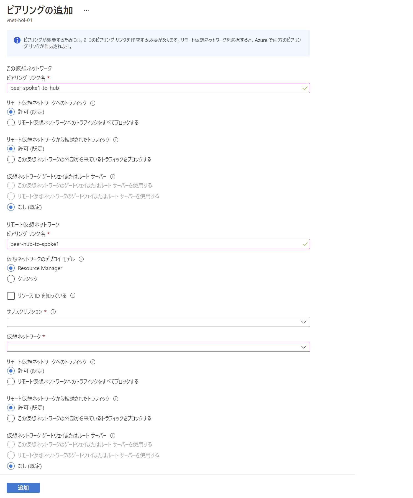

- 「**追加**」をクリックしピアリングを追加

  

<br />

## 仮想マシンへの接続

- リソース グループ内の仮想マシンを選択

- 管理ブレードの「**概要**」タブの上部から **接続** - **Bastion** を選択

  

- ユーザー名、パスワードを入力し「**接続**」をクリック

  

- 新しいタブで仮想マシンが表示

  

<br />

## Appendix

### 仮想マシンのサイズ変更

- 仮想マシンの管理ブレードから「**サイズ**」を選択

- 任意のサイズを選択し「**サイズの変更**」をクリック

  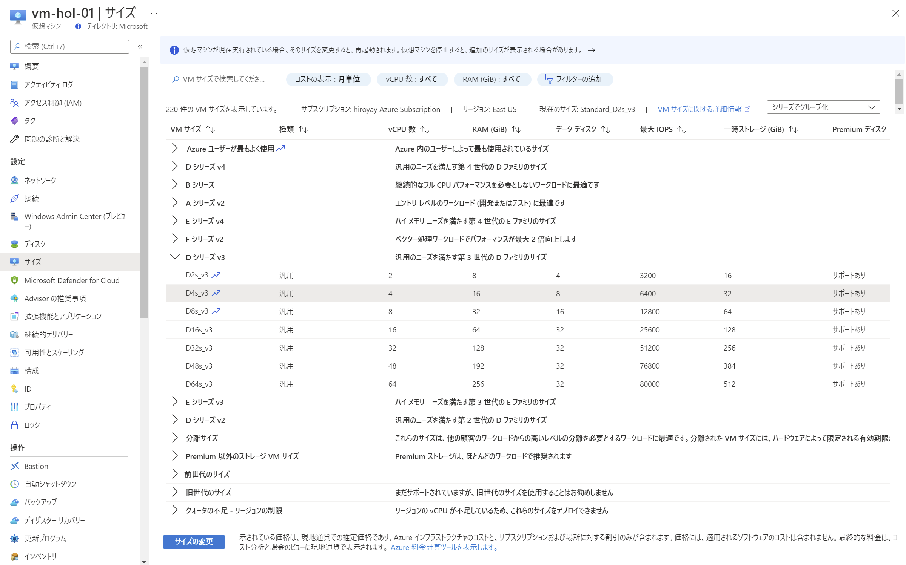

  - 変更前と変更後のサイズによっては先に割り当て解除を必要とするケースがあるので注意

  - 一時ディスクの有無は変更不可

  - 高速ネットワークをオンにしている場合は、変更後のサイズでサポートされているかを確認

<br />

### 変更履歴の確認

- Azure ポータルのホーム画面のトップバーにある検索ボックスに「**resource**」と入力

  表示される候補から「Resource Graph エクスプローラー」を選択

  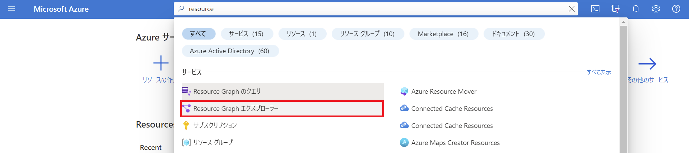

- 左ペインの「**resources**」を展開し「**microsoft.compute/virtualmachines**」をクリック

  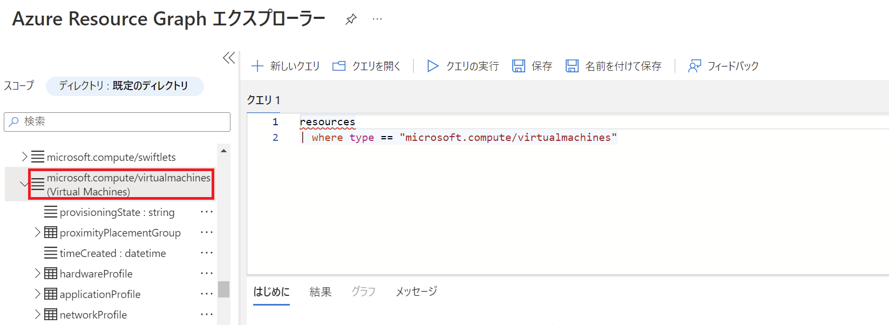

  ※ クエリが追加

- 「**osProfile**」を展開し「**computerName**」をクリック

  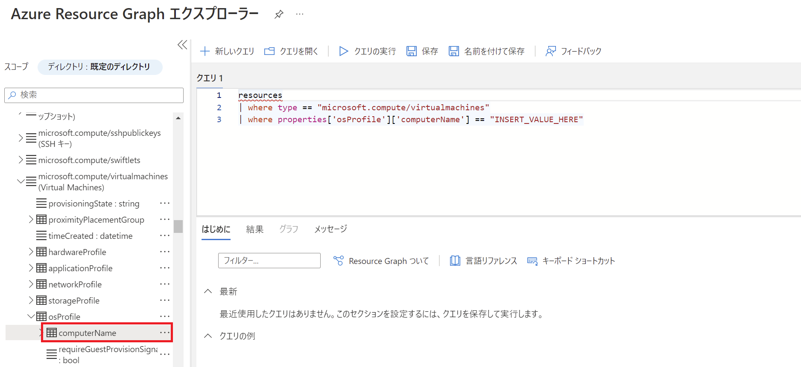

  ※ クエリに条件が追加

- クエリの INSERT_VALUE_HERE を作成した仮想マシンの名前に変更し「**クエリの実行**」をクリック

  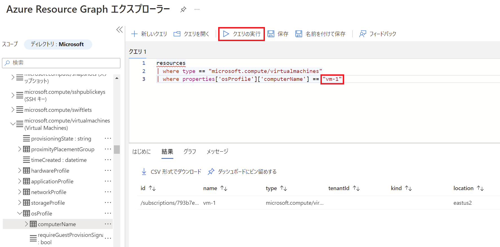

  ※ 該当リソースのレコードが表示

- クエリ結果の「**詳細の表示**」をクリック

  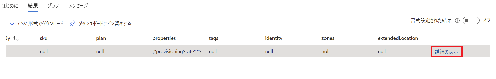

- 詳細ウィンドウが開き、設定内容等を確認可

  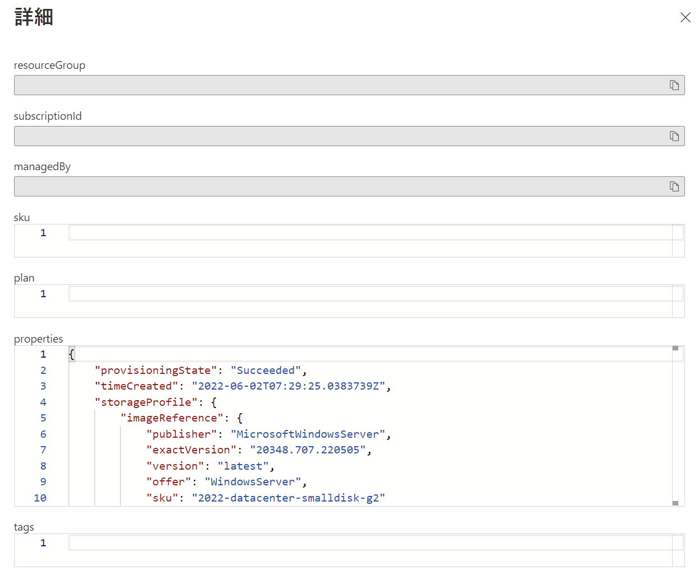

- 「**＋ 新しいクエリ**」をクリック

  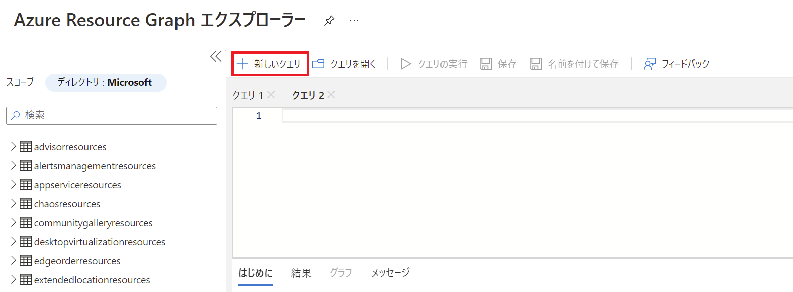

- 新しく開いたウィンドウに以下のクエリを貼り付け

  ```
  resourcechanges
  | extend changeTime = todatetime(properties.changeAttributes.timestamp), targetResourceId = tostring(properties.targetResourceId),
  changeType = tostring(properties.changeType), correlationId = properties.changeAttributes.correlationId, 
  changedProperties = properties.changes, changeCount = properties.changeAttributes.changesCount
  | where changeTime > ago(1d)
  | order by changeTime desc
  | project changeTime, targetResourceId, changeType, correlationId, changeCount, changedProperties
  ```

- 「**クエリの実行**」をクリック

  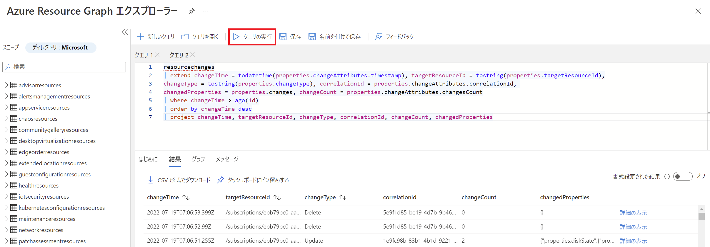

  ※ 過去１日の変更履歴が結果に表示

- 仮想マシンの過去の変更履歴を抽出するクエリ

  ```
  resourcechanges
  | extend changeTime = todatetime(properties.changeAttributes.timestamp), targetResourceId = tostring(properties.targetResourceId),
  changeType = tostring(properties.changeType), correlationId = properties.changeAttributes.correlationId, 
  changedProperties = properties.changes, changeCount = properties.changeAttributes.changesCount
  | where changeTime > ago(1d)
  | where targetResourceId == "INSERT_VALUE_HERE"
  | order by changeTime desc
  | project changeTime, targetResourceId, changeType, correlationId, changeCount, changedProperties
  ```

  ※ INSERT_VALUE_HERE に仮想マシンのリソース ID を入力

  ※ 仮想マシンのリソース ID は管理ブレードのプロパティから取得

  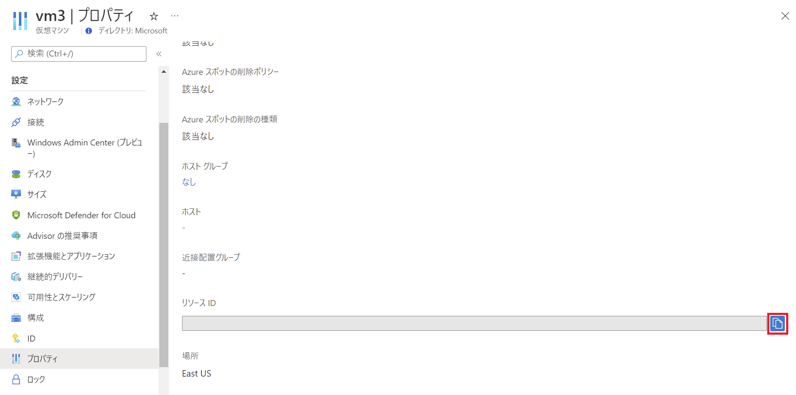

- 「**クエリの実行**」をクリック

- 結果の「**詳細の表示**」をクリック

  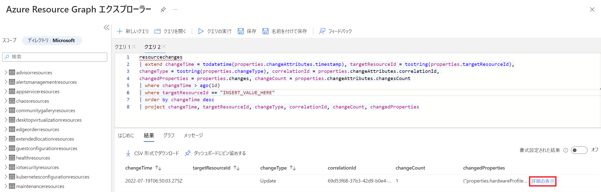

- 該当仮想マシンに実行された変更内容の詳細が表示

  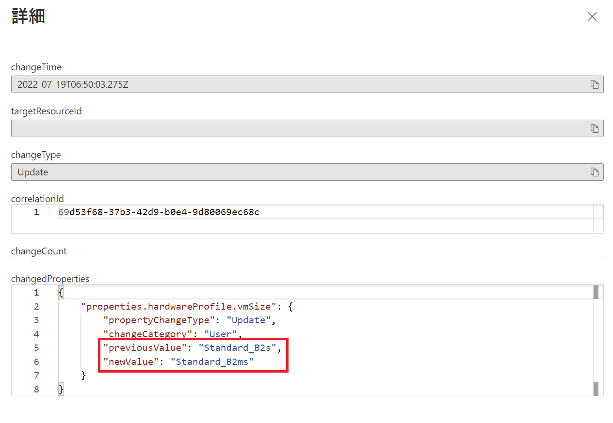

  ※ サイズ変更を実施した場合、変更前と変更後のサイズを確認可
